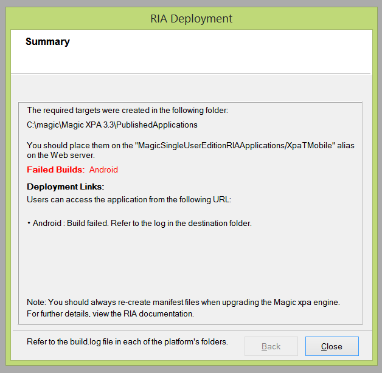
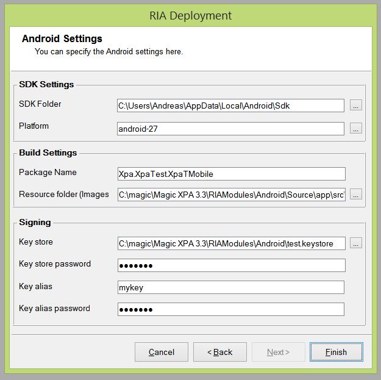
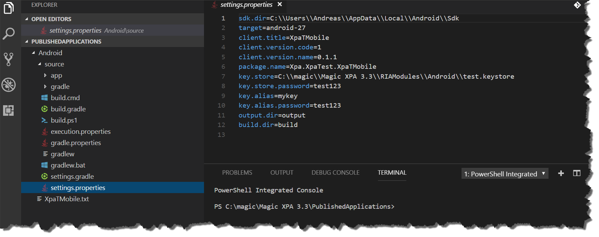

# Magic XPA RIA deployment (to Android)

Following is about the trouble I had to get a simple Magic XPA RIA program deployed to Android (SDK) and finally loaded into an emulator of a Andoid phone (I dont have one). Much (if not all) of these problems were because I reinstalled Android SDK on Windows 8.1 just recently and now have Android platform SDKs 27 & 28 there - just no version 25 and that it seems, is what current Magic XPA 3.3 needs in order to get deployment of RIA components to Android seamless.  

The Magic Xpa RIA component used for testing the features and the installation is part of XpaDemo project. It's one of it's Xpa components, in this specific case actually rather a separate / stand-alone Magic Xpa (RIA) project named [XpaTMobile](/XPATests/Components/XpaTMobile/).  

# Steps to deploy Magic XPA RIA programs(s) to Android (SDK) on Windows and run there in an emulator

## Create your RIA (Rich CLient) program / application
In order to be able to deploy something to Android we first need to have something which we can deploy to there. In Magic Xpa this is easy, just create a "Rich client" program and give it a public name. You can CTRL-G this, so its a matter of seconds. If you want something with a bit of functionality you can also do all this with the "Magic RIA" samples from your Xpa distibution samples project folder or with [XpaTMobile](/XPATests/Components/XpaTMobile/) from this demo project. Just start Magic XPA and open the project files.  

## Rich Client interface builder
When you are ready to deploy the first version of your Magic Xpa application containing Rich client (RIA) programs to Android you do this by starting the Rich client interface builder which is available in Xpa Studio, *menu: Options/Interface builder/Rich client deployment*  

A walkthrough "RIA deployment" with step-by-step instructions for this Builder will be added, at the moment it's about the problems with latest Android SDKs so we jump here to the last screen of that builder and that's the one which tells about failure or access and in our case it will be failure:   

Here is the RIA Builder screen immediately preceeding the failure screen, it shows some of the Android settings, to which we will refer later. You can see there that I chose android-27 for the Android platform SDK version: 
 

_*In the failure scree it's mentioned to refer to the log in the destination folder, I just did not yet find a log there which indicates why the deployment / build failed. The deployment destination folder in this sample is "C:\magic\Magic XPA 3.3\PublishedApplications" and that's already the first issue with the Magic Xpa RIA builder because it's a known issue with (some things in the Android SDK) that they have trouble when the pathnames do contain space characters and that's not only the case for the Android SDK but for plenty of things around build management. Probably it's better if you create yourself a directory on disk which does not have this issue like "c:\magic\ria\PublishedApplications" . Besides the fact that you do avoid the space character in the path, you do now also avoid that it resides in "Program Files (x86)" which is where the default Magic installation goes to and which is a Windows special directory where you need elevation (Admin privilleges)*_

What actually failed was the build. The sources for the build were however successfully (and obviously completely) generated from templates and adjusted to configuration settings. Destination was "C:\magic\Magic XPA 3.3\PublishedApplications" and we chose to deploy to Android (only) so the RIA application goes to a subdirectory named "Android" there and the sources and build configuration to a subdirectory "source" in the "Android" folder. There we find the settings from RIA Builder screen - as a file named "settings.properties": 
  

_*How Magic Xpa then actually builds the project is not 100% clear and there is no logfiles in PublishedApplications but it probably will execute powershell and run the powershell script build.ps1 - which then in turn uses gradle to build the project*_

That raises already two issue, you need to things working for that:
1. Powershell (needs to be in path and that was not the case for me)
2. Gradle (I do have this in the Path and installation is different from Android SDK which has it integrated in the platform SDK)

_Note: XpaDemo project has functionality / demo program which allows you to specify required components. If you add "gradle.exe" and "powershell.exe" there it will show you some information about the installation and (if it's "known" modules/components) maybe even additional information. Check the demo doc for details:  [OUTIL002_Components](/XPATests/Doc/Samples/XpaTUtils/OUTIL002_Components.md). Also [OUTIL001_About](/XPATests/Doc/Samples/XpaTUtils/OUTIL001_About.md) which has some more information regarding the Java installation on your machine_
