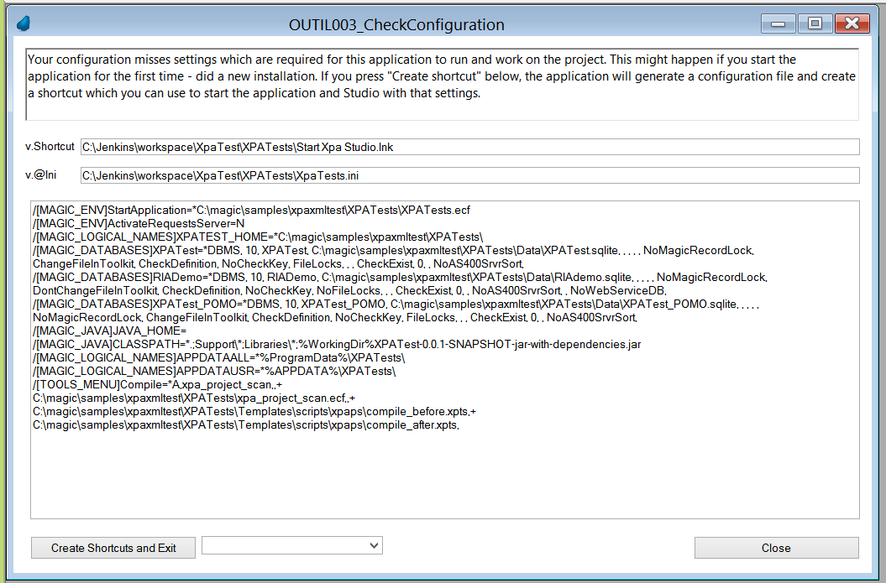

# OUTIL003_CheckConfiguration

OUTIL003_CheckConfiguration is a program which is called during startup to check if required components and configuration settings are existing and valid. If this is not the case, or if the program is called after startup from menu manually, it opens a screen to review (or redo the configuration). 

## Screen

  
## Buttons
### Create shortcuts and exit
Writes the settings as a @INI Merge file to your installation path (%XPATEST_HOME% resp. %WorkingDir%) and creates in that folder two Windows shortcuts (links) which have this @Ini on the command line (target). Afterwards there is a "Exit System" acrion performed and the application is closed. You know can restart Studio or Runtime by double-click on one of the two shortcuts and now, since the configuration is valid and all required settings do exist, OUTIL003_CheckConfiguration won't open that configuration screen but you can start using the application.  

### Combobox with script selection
Allows you to review the (vbs) scripts which are used to create the shortcuts. If you select an entry OUTIL003_CheckConfiguration will start notepad with the pathname of that script on command line.

# Furter Notes / implementation details
You can disable execution of this program during startup by putting following value in the .INI: [XPATEST]CHECKCONFIG=N 
Default behaviour (or if entry is missing) is CHECKCONFIG=Y 

Templates for @Ini and .vbs scripts:
- [XpaTests.ini](/XPATests/Templates/ini/XpaTests.ini)
- [CreateShortcut.vbs](/XPATests/Templates/scripts/wsh/CreateShortcut.vbs)  
Rememeber to update these templates if you add .INI settings.  

The .vbs scrripts are executed with wscript.exe. In some environments this wont work, there's Antivirus which is configured to detect and disallow "script activity". You then have to create the shortcuts manually or execute the scripts by double-click (which then might work or might still not work).  

The name "XpaTests" is not hardcoded in this application but is fetched by invocation of XPAs AppName() function. If you rename your application or if you use the program in another application (by import or as a component), it should still work.

- 
