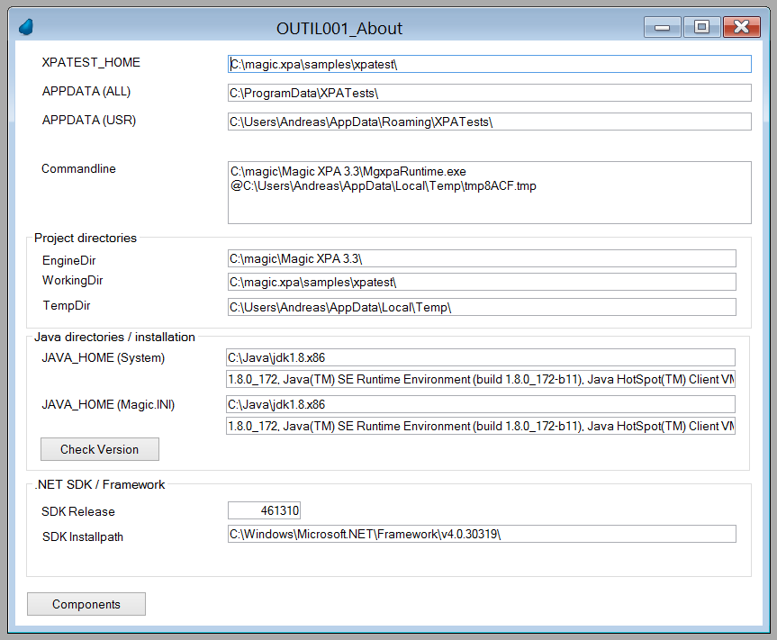

# OUTIL001_About

OUTIL001_About is the "About" screen of the XPATEST application. You can get to it my selecting Help/About from the menu. It will display some information about the application, installed components and frameworks and it has functionality which helps to fix a broken installation, ...   

## Screen

## Fields
### XPATEST_HOME
Here the value of logical name %XPATEST_HOME% gets displayed. That's the logical name which needs to point to the base directory of the application and which is required to resolve all relative pathnames.

Before the value is actually displayed, the program checks if it contains a value. If its empty it will be set to %WorkingDir% (the logical name Magic Runtime injects and which should point to the directory where the applicarion's .ecf resides)

Afterwards it's checked if the file %XAPATEST_HOME%XPATests.ecf exists.  
  
### Commandline
That's the commandline which was used to start the application (either the Runtime or the Studio). Program OUTIL101_GetCommandline gets executed to fetch this information.

### Project directories
Here the values of the three "special" logical names get displayed which the Magic runtime environemnt will set and which an application can query  
* EngineDir (path to the Magic engine resp. runtime environment)
* WorkingDir (path to the application directory)
* TempDir (path to temporary directory for the user)  
  
### Java directories / installations
#### JAVA_HOME (system)
That's the value of the system environment variable JAVA_HOME which typically gets set if you install Java on your machine
#### JAVA_HOME (Magic.INI)
That's the value of the .INI setting [MAGIC_JAVA]JAVA_HOME which can be used to overwrite the system setting when Magic has to start a JVM. If you do not overwrite JAVA_HOME in the Magic.INI the "default" JVM will be started and most of the time that will be one which Magic cannot use because it's either 64-Bit or a later version, not yet supported by Magic.

OUTIL001_About checks if the JAVA_HOME points to a Java version which is compatible with Magic XPA, it can however not set this value for you if it's empty. For that it would have to scan the complete harddisk for existing Java installations.  

Below JAVA_HOME (system) and JAVA_HOME(Magic.INI) are two hidden fields for version information which do get filled and displayed if you press the "Check Version" button

### .Net SDK / Framework
#### SDK Release
#### SDK Installpath
OUTIL001_About uses program Roslyn.ROSL003_CheckFramerworkSDKs to gather information about the installed .NET Framework(s) and displays the release id and the installation path then here - in case it found one. If there's multiple Framework SDKs on your machine, information about the latest one will be displayed. A listr of all installed .NET SDKs you then get with a different program.  

### CLR version
XPATEST requires a .NET Framework >= 4.5 for some of its functionality. Most of the .NET stuff does however not require that SDK but will run fine with the .NET Runtime (CLR). The version of the CLR which gets used (and which is also the Version the Magic Runtime uses) gets displayed here.  

## Buttons
### Check Version (Java)
Runs program BUTIL201_CheckJavaVersion for the Java JAVA_HOME path specified in JAVA_HOME (system) and # JAVA_HOME (Magic.INI) and fills the Java Version fields with the result.

### Components
Starts program [OUTIL002_Components](OUTIL002_Components.md). For more information check there. It's an online (line mode) browse program for XPATEST table DatabaseComponent.xpatest_comp where some of the optional and mandatory components of XPA can be configured and checked (for existence and proper installation / configuration).  

